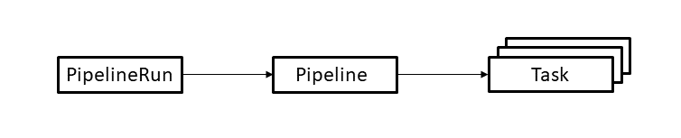

# OpenShift Deployment using Tekton Pipelines

Tekton is an open source project to configure and run CI/CD pipelines within a OpenShift/Kubernetes cluster.

## Introduction

In this tutorial you will learn:

* the basic concepts in Tekton pipelines,
* how to create a pipeline to build an image and deploy a container,
* how to run the pipeline, check its status and troubleshoot problems.

Also, check out this [very good tutorial](https://github.com/openshift/pipelines-tutorial) by Red Hat.

## Estimated time

1 hour

## About Tekton

[Tekton](https://tekton.dev) is an open-source framework for creating CI/CD pipelines. Tekton is governed by the [Continuous Delivery Foundation (CDF)](https://cd.foundation), which includes among other the following special interest groups:

* Best practices,
* Interoperability,
* MLOps,
* Security.

Tekton provides a set of extensions of the Kubernetes API for defining pipelines, in the form of [Custom Resources](https://kubernetes.io/docs/concepts/extend-kubernetes/api-extension/custom-resources/). Tekton consists of about 15 projects like Pipelines, Triggers, Results, Chains, Operator, Catalog, Dashboard, CLI and Hub.

A Step is equivalent to a Container. You can define the name, image, environment and a script to run inside the container. A Task executes a Pod and is a sequence of steps, which runs a sequence of Containers. All Steps in a Task can access a shared workspace, an implicit volume of the pod. A Pipeline is a collection of Tasks, that runs a set of Pods, that can run sequentially or conditionally. Pipeline has access to a shared persistent volume (workspace) and combines tasks through the workspace and results output. The pipeline also provides a finalizer function. Pipeline and Tasks are executed by PipelineRun and TaskRun. To automatically invoke these you can create a Trigger. A TriggerBinding extracts data from the event payload, and a TriggerTemplate creates the template for the PipelineRun. The EventListener is a CRD that combines the TriggerBinding and the TriggerTemplate. You can find existing pipeline resources in the Tekton Catalog or Tekton Hub.

### Tekton at IBM

* IBM Cloud Continuous Delivery,
* IBM Code Engine,
* Watson AI Pipelines,
* IBM Datastage ETL services,
* RedHat OpenShift Pipelines.

## About this Tutorial

The following diagram shows the resources used in this tutorial. The arrows depict references from one resource to another resource.

The resources are used as follows.

* A **PipelineRun** defines an execution of a pipeline. It references the **Pipeline** to run.
* A **Pipeline** defines the set of **Tasks** that compose a pipeline.
* A **Task** defines a set of build steps such as compiling code, running tests, and building and deploying images.

## About this Workshop

In this workshop, you will learn more about each resource and create a simple pipeline that:

* builds a Docker image from source files and pushes it to your private container registry,
* deploys the image to your OpenShift cluster.

We will first define the Task resources needed to build and deploy the image.
Then we will define the Pipeline resource that references the tasks,
and finally we will create the PipelineRun resource needed to run the pipeline.

## Steps

