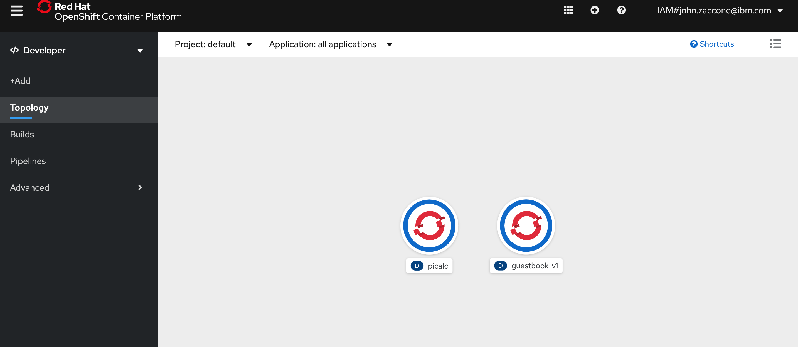
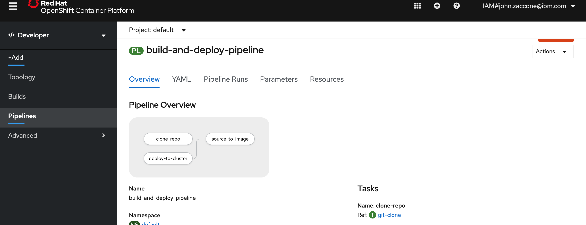

# 7. Run the Pipeline

All the pieces are in place to execute the pipelinerun by creating the PipelineRun resource in your cluster.

```bash
$ oc create -f tekton/run/picalc-pipeline-run.yaml
pipelinerun.tekton.dev/picalc-pr-c7hsb created
```

Note that we're using `oc create` here instead of `oc apply`. As mentioned before, a given PipelineRun resource can run a pipeline only once, so you need to create a new PipelineRun each time you want to run the Pipeline. `kubectl` or `oc` will create the generated name of the PipelineRun resource.

View the status of our pipeline run,

```bash
$ oc get pipelinerun
NAME              SUCCEEDED   REASON    STARTTIME   COMPLETIONTIME
picalc-pr-dqwqb   Unknown     Running   5s
```

The pipeline will be successful when `SUCCEEDED` is `True`.

```bash
$ oc get pipelinerun
NAME              SUCCEEDED   REASON      STARTTIME   COMPLETIONTIME
picalc-pr-x5qf9   True        Succeeded   2m58s       12s
```

Check the status of the Kubernetes deployment.  It should be ready.

```bash
$ oc get deploy picalc
NAME     READY   UP-TO-DATE   AVAILABLE   AGE
picalc   1/1     1            1           9m
```

You can curl the application using its NodePort service.
First display the nodes and choose one of the node's external IP addresses.
Then display the service to get its NodePort.

```bash
$ kubectl get nodes -o wide
NAME           STATUS   ROLES    AGE     VERSION       INTERNAL-IP    EXTERNAL-IP      OS-IMAGE             KERNEL-VERSION      CONTAINER-RUNTIME
10.221.22.11   Ready    <none>   7d23h   v1.16.8+IKS   10.221.22.11   150.238.236.26   Ubuntu 18.04.4 LTS   4.15.0-96-generic   containerd://1.3.3
10.221.22.49   Ready    <none>   7d23h   v1.16.8+IKS   10.221.22.49   150.238.236.21   Ubuntu 18.04.4 LTS   4.15.0-96-generic   containerd://1.3.3

$ kubectl get svc picalc
NAME     TYPE       CLUSTER-IP      EXTERNAL-IP   PORT(S)          AGE
picalc   NodePort   172.21.199.71   <none>        8080:30925/TCP   9m

$ EXTERNAL_IP=150.238.236.26
$ NODE_PORT=30925
$ curl $EXTERNAL_IP:$NODE_PORT?iterations=20000000
3.1415926036
```

## Debugging a failed PipelineRun

Let's take a look at what a PipelineRun failure would look like.
Edit the PipelineRun yaml and change the gitUrl parameter to a non-existent Git repository to force a failure.
Then create a new PipelineRun and describe it after letting it run for a minute or two.

```bash
$ kubectl create -f tekton/picalc-pipeline-run.yaml
pipelinerun.tekton.dev/picalc-pr-sk7md created

$ tkn pipelinerun describe picalc-pr-sk7md
Name:              picalc-pr-sk7md
Namespace:         default
Pipeline Ref:      build-and-deploy-pipeline
Service Account:   pipeline-account

Status

STARTED         DURATION     STATUS
2 minutes ago   41 seconds   Failed

Message

TaskRun picalc-pr-sk7md-clone-repo-8gs25 has failed (&#34;step-clone&#34; exited with code 1 (image: &#34;gcr.io/tekton-releases/github.com/tektoncd/pipeline/cmd/git-init@sha256:bee98bfe6807e8f4e0a31b4e786fd1f7f459e653ed1a22b1a25999f33fa9134a&#34;); for logs run: kubectl -n default logs picalc-pr-sk7md-clone-repo-8gs25-pod-v7fg8 -c step-clone)

Resources

 No resources

Params

 NAME             VALUE
 gitUrl           https://github.com/IBM/tekton-tutorial-not-there
 pathToYamlFile   kubernetes/picalc.yaml
 imageUrl         us.icr.io/gregd/picalc
 imageTag         1.0

Taskruns

 NAME                               TASK NAME    STARTED         DURATION     STATUS
 picalc-pr-sk7md-clone-repo-8gs25   clone-repo   2 minutes ago   41 seconds   Failed
```

The output tells us that the `clone-repo` pipeline task failed.  The `Message` also tells us how to get the logs from the pod which was used to run the task:

```bash
for logs run: kubectl -n default logs picalc-pr-sk7md-clone-repo-8gs25-pod-v7fg8 -c step-clone
```

If you run that `kubectl logs` command you will see that there is a failure trying to fetch the non-existing Git repository.

An even easier way to get the logs from a PipelineRun is to use the `tkn` CLI.

```bash
tkn pipelinerun logs picalc-pr-sk7md-clone-repo-8gs25-pod-v7fg8 -t clone-repo
```

If you omit the `-t` flag then the command will get the logs for all pipeline tasks that executed.

You can also get the logs for the last PipelineRun for a particular Pipeline using this command:

```bash
tkn pipeline logs build-and-deploy-pipeline -L
```

You should delete a PipelineRun when you no longer have a need to reference its logs.  Deleting the PipelineRun deletes the pods that were used
to run the pipeline tasks.

## Check it out in OpenShift Console

OpenShift provides a nice UI for the pipelines and the applications deployed. From the OpenShift console, click **developer** in the upper left drop-down to get to the developer view. Then click **Topology** to view your running app.



Click **Pipelines** to explore the pipline your created and explore the PipelineRuns



## Summary

Tekton provides simple, easy-to-learn features for constructing CI/CD pipelines that run on Kubernetes. This tutorial covered the basics to get you started building your own pipelines. There are more features available and many more planned for upcoming releases.
